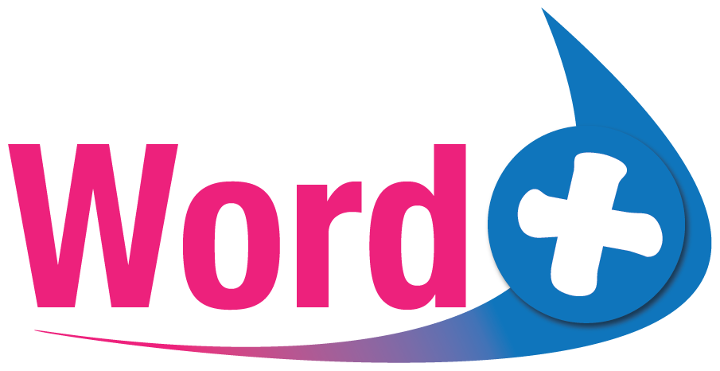

# Word Positive

**Kapil Yadav** & **Nathaniel Brown**

HackMIT, Fall 2021

  

A kid-friendly spaced-repetition app with machine vision and curated word discovery for different age groups.

## Running the App

There are two components of the app to configure:

* **The App**: This can be run on XCode for Mac, but you'll need to provide your own signing.
* **The Server**: Run this as a standard Flask server. You may have to do some fiddling with the code in the app to ensure you're pointing to the right URL, whether that be localhost or otherwise.